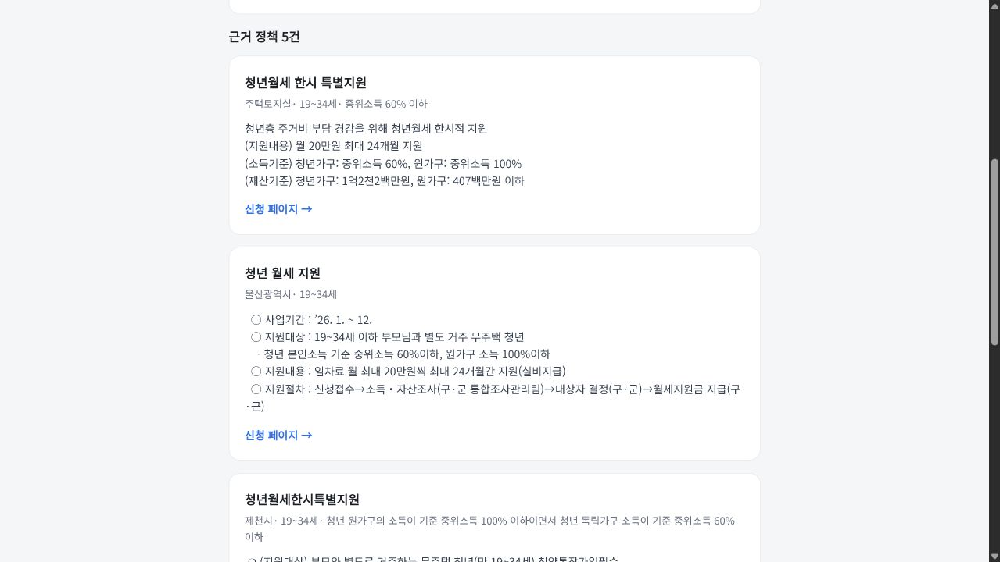

# 혜택나침반 (BenefitCompass)

**라이브 데모:** https://crushonyou2.github.io/benefit-compass — *첫 요청은 무료 티어 콜드스타트로 30~60초 걸릴 수 있습니다.*

청년정책은 부처와 지자체에 수천 개씩 흩어져 있어서, 정작 내가 받을 수 있는 게 뭔지 찾기가 번거롭습니다. 나이 같은 조건과 "월세 지원 받고 싶어" 같은 질문을 넣으면 관련 청년정책을 찾아 근거와 함께 답해주는 RAG 검색 서비스입니다.

온통청년 API에서 정책 2,631건을 모아 정제하고, 임베딩 → 벡터검색 → 리랭킹 → 답변 생성으로 이어지는 RAG 파이프라인을 직접 붙였습니다. LLM에 검색 결과를 그냥 던지는 대신 단계를 쪼갰고, 검색이 실제로 맞는지 평가셋으로 재본 다음 리랭킹으로 정확도를 끌어올렸습니다.



## 어떻게 동작하나요

```
[React / Vite]                 사용자 입력 (질문 + 나이)
      │  POST /api/ask
      ▼
[Spring Boot API]  ── 요청 검증 · 오케스트레이션 · Gemini 답변 생성 (gemini-3.1-flash-lite)
      │  POST /search
      ▼
[Python FastAPI · ML]  ── e5 질의 임베딩 → pgvector 검색(30) → bge 리랭킹 → 임계값 컷
      │
      ▼
[Postgres + pgvector (Neon)]   정책 메타(구조화) + 본문 청크 벡터(768d)
```

백엔드 주력은 Spring Boot(Java 17)로 두고, 임베딩·리랭킹 같은 ML 부분만 Python으로 떼어낸 마이크로서비스 구조입니다. 임베딩과 리랭킹은 로컬 모델로 돌려 비용과 호출 한도 부담이 없고, 답변 생성에만 Gemini 무료 티어를 씁니다.

## 검색 품질

질문 60개짜리 평가셋을 만들어(각 질문에 정답 정책을 라벨링) 정답이 상위에 오는지 측정했습니다. 리랭커(bge-reranker-v2-m3)를 붙였더니 1순위 정답률(recall@1)이 **40%에서 52%로** 올랐습니다.

| 지표 | bi-encoder | + 리랭킹 |
|---|---|---|
| recall@1 | 0.400 | 0.517 |
| recall@5 | 0.733 | 0.717 |
| recall@10 | 0.800 | 0.783 |
| MRR@10 | 0.535 | 0.614 |

recall@5/@10이 살짝 내려간 건 60문항 기준 1문항 차이라 사실상 노이즈입니다. 평가셋 생성은 `eval/make_evalset.py`, 측정은 `eval/run_eval.py`(기본)와 `eval/run_eval_rerank.py`(리랭킹)로 재현할 수 있습니다.

## 기술 스택

| 영역 | 사용 기술 |
|---|---|
| 프론트 | React 18, Vite |
| API | Spring Boot 3.3 (Java 17), RestClient(Apache HttpClient5) |
| ML | Python, FastAPI, sentence-transformers |
| 임베딩 | `intfloat/multilingual-e5-base` (768d, 로컬) |
| 리랭커 | `BAAI/bge-reranker-v2-m3` |
| 생성 | Google Gemini (`gemini-3.1-flash-lite`) |
| 저장소 | PostgreSQL + pgvector (Neon) |
| 데이터 | data.go.kr 온통청년 청년정책 OpenAPI |

## 만들면서 했던 선택들

- **RAG를 단계별로 직접 구성했습니다.** 검색 결과를 LLM에 통째로 넘기지 않고 임베딩·벡터검색·리랭킹·생성을 나눠 두니, 어느 단계가 품질을 좌우하는지 평가셋으로 따로 재볼 수 있었습니다.
- **임베딩은 로컬 모델로 돌립니다.** 처음엔 Gemini 임베딩을 쓰려 했는데 무료 티어가 분당·일일 한도에 금방 걸려서, 한국어에 강한 e5 모델을 로컬로 돌리는 쪽으로 바꿨습니다. 덕분에 비용도 한도도 없습니다.
- **API는 Spring Boot, ML은 Python으로 나눴습니다.** ML 라이브러리는 Python 생태계가 편하고, 비즈니스 로직은 제가 익숙한 Spring Boot가 나아서 둘을 분리했습니다.
- **답변은 검색된 정책만 근거로 씁니다.** 모델이 임의로 지어내지 않도록 검색 결과 안에서만 답하게 하고, 정책명을 같이 인용하게 했습니다. 마땅한 게 없으면 "없다"고 단정하지 않고 다시 검색해 보길 안내합니다.
- **Neon이 유휴 상태에서 잠드는 점을 감안했습니다.** 풀의 커넥션이 죽는 문제가 있어서 요청마다 새로 연결하도록 했습니다.
- **지역 필터는 구현했지만 사용자에게 노출하지 않기로 했습니다.** `zipCd`를 법정동코드로 적재해 검색 SQL에 지역 조건까지 걸었는데, 서울로 필터링해도 함안군 정책이 통과했습니다. 진단 스크립트(`ingest/inspect_region.py`)로 원본을 덤프해 보니 지자체 정책에 타지역 코드가 섞여 있었고 기관명도 부서명뿐인 경우가 많았습니다. 기관명 기반 보강 필터(`ml-service/app.py`의 `region_filter`)를 덧대 봤지만 원본이 틀린 이상 신뢰할 수 없다고 보고, 틀린 필터를 노출하는 대신 웹 UI에서 지역 입력을 빼고 지원 내용으로 검색하도록 안내했습니다. 질의에 섞여 들어온 지역어는 잡음이 되므로 검색 전에 제거합니다(`strip_region`). 필터 코드는 백엔드(ML·API·CLI)에 그대로 남아 있고, 프론트가 `region`을 보내지 않는 방식으로 경로만 끊어둔 상태입니다.

## 아직 부족한 부분

- **지역으로는 아직 검색할 수 없습니다.** 위에 적은 이유로 노출을 끊어둔 상태입니다. 지역코드를 정제하거나 신뢰할 수 있는 출처를 따로 확보하는 게 선행 과제이고, 그 전까지는 되살리지 않을 생각입니다. 데이터가 정리되면 `ingest/search.py --region`으로 바로 다시 검증할 수 있습니다.
- **지금은 청년정책만 다룹니다.** 전국민 대상 혜택(행정안전부 gov24)은 odcloud 게이트웨이 인증 권한 문제로 적재를 미뤄둔 상태입니다.

## 운영 관측 기반

- `/actuator/health`: 배포 상태 확인
- `/actuator/prometheus`: endpoint·상태 구간별 지연시간, 검색 결과/무결과 수집
- 모든 API 응답에 `X-Request-ID`를 넣어 장애 로그를 추적
- 질문 원문과 나이는 로그·메트릭에 저장하지 않음

초기 운영 목표와 장애 확인 절차는 [SLO 초안](docs/operations/SLO.md), [운영 런북](docs/operations/RUNBOOK.md)에 기록했습니다. 아직 측정하지 않은 목표값은 성과로 주장하지 않습니다.

2026-07-14 개선 전 기준선에서 검색 전용 첫 요청은 58.909초, 이후 5회는 평균 0.815초였습니다. 모두 정책 5건을 반환했으며, 상세 조건과 원본 값은 [운영 기준선](docs/operations/BASELINE_2026-07-14.md)에 공개했습니다.

같은 날 관측 코드를 Cloud Run `benefit-api-00002-ndd`로 배포했습니다. health·Prometheus·검색·요청 ID를 검증했으며, CRLF로 인한 첫 빌드 실패와 복구 과정은 [배포 기록](docs/operations/DEPLOYMENT_2026-07-14.md)에 남겼습니다.

## 실행 방법

```bash
# 1) 데이터 수집 + 임베딩 + 적재 (pgvector를 지원하는 Postgres 필요, Neon 등)
cd ingest && python -m venv .venv && .venv\Scripts\activate
pip install -r requirements.txt -r ../ml-service/requirements.txt
python ingest_youth.py && python embed.py && python load_db.py

# 2) ML 서비스
cd ../ml-service && uvicorn app:app --port 8000

# 3) API (Spring Boot) — 다른 터미널
cd ../api && set GEMINI_API_KEY=... && gradlew bootRun

# 4) 프론트 — 다른 터미널
cd ../web && npm install && npm run dev   # http://localhost:5173
```

`.env`에는 `DATABASE_URL`(Neon), `YOUTH_API_KEY`(data.go.kr), `GEMINI_API_KEY`(Google AI Studio)가 필요합니다.

---

비영리 학습·포트폴리오 프로젝트입니다. 데이터 출처는 온통청년(공공데이터포털)입니다.
